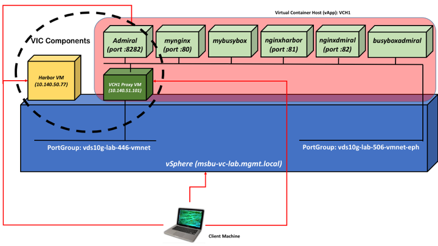

This is a script that allows the stand up of a basic vSphere Integrated Containers (VIC) solution against an existing vSphere 6.0 or 6.5 environment.

The script is architected with a set of modular atomic operations defined as functions. These functions are then executed as part of `main`. This makes it easy to enable, disable or shuffle around parts of the entire flow or add additional functions to the flow.  

##Components Overview
VIC is comprised of three major components:

- [VIC Engine](https://github.com/vmware/vic): this is responsible for exposing vSphere constructs as Docker constructs
- [Harbor](https://github.com/vmware/harbor): this is a Docker compatible enterprise registry
- [Admiral](https://github.com/vmware/admiral): this provides a portal on top of the Virtual Container Hosts.

The setup architecture that is described in this page may change for future releases.

The following picture shows the outcome of executing the `vic-product-machine.sh` script against a vanilla vSphere infrastructure:

You should consider the `VCH1 proxy VM`, the `Harbor VM` and the `Admiral` ContainerVM the components that comprise VIC (and the components that are deployed by this script).

The script (as-is) deploys also an nginx docker image as part of the flow (this is done just to test that the VCH has been deployed correctly). You should consider this nginx containerVM (and every other containerVM, with the exception of Admiral) as "VIC user workloads".

##Script flow
At the high level, this is what the script does:
- it prints the variable settings that it's going to use
- it checks if the system where it's being executed on has the prerequisites (e.g. `ovftool`, `curl`, `sed`, etc.)
- it grabs the Harbor OVA
- it extracts the Harbor OVA
- it imports the Harbor OVA into vSphere
- it grabs the VIC binaries
- it extracts the VIC binaries
- it deploys the VCH on vSphere
- it pulls the `nginx` image
- it instantiate said image against the VCH above
- it pulls the `admiral` image
- it instantiate said image against the VCH above
- it grabs the Admiral CLI
- it configures the Admiral CLI
- it adds the VCH above as an host in Admiral  

##Usage
Clone the repo and edit the `vic-product-machine.sh` script.

Tweak the variables in the `USER INPUTS` section at the beginning.

Run the script.

Cross your fingers.

While I don't foresee the script to be disruptive I suggest you run this in a test vSphere environment. This script should be used as an asset for educational and test purposes, not for deploying production environments. Sure the script can be adapted and expanded to support automated production deployments but in the current shape and form it has too many rough edges and too few controls to be considered production grade.

After the `USER INPUTS` section there is a `DO NOT TOUCH THESE UNLESS YOU KNOW WHAT YOU ARE DOING` section. These are some variables that are used during the execution of the script to download the proper versions of the various software and other stuff the user shouldn't really change (unless the user knows what she's doing).

##Known Limitations
- This script has only been tested with VIC version 1.0 (which includes VIC engine 0.8, Harbor 0.5.0). At the time of this writing Admiral hasn't GAed with VIC but the script has been tested with Admiral version 0.9.1
- The script has been tested on both Mac and Linux. Provided you pass the system checks and you have the prerequisites installed, it should run fine. The script has never been tested on Windows and it will almost certainly break in many points.
- The script as-is always pulls the latest version of Admiral from Docker hub. This means that, in the future, this script will grab arbitrary versions of Admiral that haven't been tested and the script may/will break. A quick fix would be to explicitly call out the Admiral version you want to deploy (e.g. 0.9.1).
- There is a known problem with the check performed in the `deployVch` function. The latest VIC versions are more secured than previous versions and now require you to accept the vCenter certificate during the `ls` but `ls` doesn't accept the `--force` option. Because of this, now that check fails making that function no longer idempotent (the issue is tracked [here](https://github.com/vmware/vic/issues/3117))
- There is not a "tear down" equivalent of the `vic-product-machine.sh` deployment script (nor a flag to pass to the script to tear down a VIC setup). A user has to remove each component manually and individually. This is something that may be useful to add in the future (keeping in mind that tearing down anything is always more risky than setting up something)
- The script, in its current shape, assumes that both the Harbor and the VCH instance are deployed using fixed IP addresses (both configurable in the `USER INPUTS` section at the beginning). While these components both support being deployed with DHCP the script (as is) doesn't accept that as an input.
- The script has a relatively beefy list of dependencies (checked when it's launched). Right now these are: `curl`, `grep`, `sed`, `tar`, `unzip`, `docker` (the client binary at least) and `ovtool`. Note that `ovftool` requires signing up on vmware.com to be able to grab it (via a UI) so automating the setup of all these utilities may be challenging (assuming that's the right thing to do).   
